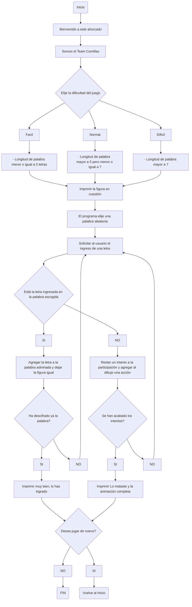

# Juego Ahorcado en Python
**Equipo:  "Los comillas"**

[](https://postimg.cc/t7ywmKpw)
- Juan Camilo Morales Hernandez
- Arturo Moreno Covaría

Bienvenidos a nuestro repositorio del proyecto final de nuestra clase de programación de computadores de la Universidad Nacional de Colombia del semestre 2023-I, el cual consistía en crear un juego de ahorcado utilizando Pyhton.

## Objetivos del Proyecto
- Colocar en práctica los conceptos aprendidos durante el semestre 2023-I en la clase de programación de computadores, haciendo uso de los recursos a disposición para la elaboración del proyecto
- Desarrollar aptitudes relacionadas a la resolución de problemas dentro del ámbito de la programación
- Manejar de la manera más óptima posible ciertos tipos de habilidades blandas, tales como el trabajo en equipo, la planificación de proyectos, el manejo del tiempo y el trabajo del estrés y la presión.

## Introdución:
A continuación se hará un breve repaso por los conceptos y los recursos usados dentro del argot de la bella ciencia de la progrmación que se tuvieron en cuenta para la relización del código del juego diseñado.


## Procedimiento:
Se presentará el paso a paso para costruir el código desarrollado para que el juego funcione.

1. Se crea una lista con las palabras de las cuales se harán uso en el ahorcado, es decir las que se adivinarán, es menester recordar que una lista se delimita con brackets (**[ ]**), se separan los elementos dentros de ella, en este caso las palabras mediante una coma (**,**), y si los elementos son strings (como efectivamente lo son en el código) se definen cada string entre unas comillas (**" "**). De la siguiente manera:
   ```sh
   listaPalabras = ["Perro", "Real Madrid", "Bogotá", "Queen", "Silla", "Rey León", "Argentina", "Ciclismo", "explorar", "Python"]
   ```
   En la realización del juego se definieron dentro de la lista una cantidad de 1355 palabras, las cuales se incluyeron primeramente dentro de un diccionario que contenía listas según la categoría de las palabras, tales como animales, países, acciones, programación, películas, equipos de fútbol, jugadores de fútbol, libros, comida, carreras universitarias, música, objetos, ciudades y marcas, no obstante dentro de la ejecución del código se logró evidenciar que la definición de dichas palabras dentro de listas que a su vez estaban dentro de un diccionario no era muy viable para la realización del programa, así que se decidió eliminar dicho diccionario y las listas de categorías que estaban dentro de él, y colocar simplemente las palabras dentro de una sola lista.
de la siguiente manera:


2. Importar el módulo random, el cual permitirá posteriormente elegir de la lista una palabra aleatoria, la cual al ejecutar el codigo será la que el usuario intente desifrar.
   
   ```sh
   import random
   ```

   
3. Se define una función denominada bienvenida, que como su nombre lo indica imprimirá el mensaje inicial en el juego, imprimiendo al correr el código el nombre del juego, los nombres de los participantes del proyecto y el nombre del equipo que realizó dicho trabajo, la función no recibe argumentos, ya que simplemente imprime el mensaje definido en ella.
   
   ```sh
   def bienvenida():
    print("Bienvenid@ a nuestro ahorcado")
    print("somos Arturo Moreno y Juan Morales de Team comillas")
   ```
   
   
4. Ahora bien, ya teniendo la lista de palabras disponibles para el desarrollo del juego y el modulo random importado, se creó una función que usa como argumento la lista, en este caso tiene el nombre de diccionario, en dicha función a la variable palabra se le asigna el dato o valor resultante de la función random.choice y de la aplicación del método .lower(), y se retorna el valor de dicja variable.
   
   ```sh
   def Palabra(diccionario):
    palabra = random.choice(diccionario).lower()
    return palabra
   ```
   La función random.choice selecciona un elemento de forma aleatoria proveniente de una secuencia (lista, tupla, diccionario), teniendo todos los elementos de dichas secuencias la misma probabilidad de ser seleccionados; por otra parte el método .lower() hace que una determinada variable seleccionada se convierta a minúsula. Los elementos descritos anteriormente se usaron para extraer una palabra de esa gran lista de palabras y convertirla a minúscula para facilitar la experiencia del usuario.
   Un ejemplo de como funciona random.choice y .lower().
      ```sh
   import random
   listaPalabras = ["Perro", "Real Madrid", "Bogotá", "Queen", "Silla", "Rey León", "Argentina", "Ciclismo", "explorar", "Python"]
   palabra = random.choice(listaPalabras).lower()
   print(palabra)
   ```
   
   

   
5. Posteriormente se trabaja en la elección por parte del usuario de la dificultad del juego, definiendo una función con el argumento de la lista, la cual en nuestro caso, irónicamente tiene el nombre de diccionario.
   - Primero, se solicita el ingreso del nivel en el que se quiere jugar (fácil, normal o difícil), se utiliza el método .lower() en caso que el usuario digite en mayúsculas, luego se llama a la función de la elección aleatoria de la palabra definida en el paso anterior.
   - Segundo, se inicializa un bucle while con b en 1 que hará que el proceso que definiremos a continuación se defina hasta cierto punto o mejor dicho, hasta cierta condición específica.
   - Tercero, dentro del bucle realizar tres condicionales para cada nivel de dificultad, para el fácil establecerse si la longitud de la palabra es menor o igual a 5, para el  normal si es mayor a 5 y menor o igual a 7 y por último difícil si la longitud de la palabra es menor a 7 letras.
   Finalmente cuando queda asignada la palabra escogida a un nivel de dificultad se retorna la función y se finaliza el bucle while.
   
   ```sh
   def dificultades(diccionario):
    a =input("Ingrese la dificultad en la que desea jugar (facil, normal, dificil): ").lower()
    palabra = Palabra(diccionario)
    b = 1
    while b == 1:
        if a == "facil":
            if len(palabra) <= 5:
                b = 2
                return palabra
            else:
                palabra = Palabra(diccionario)
        elif a == "normal":
            if 5 < len(palabra) <= 7:
                b = 2
                return palabra
            else:
                palabra = Palabra(diccionario)
        elif a == "dificil":
            if len(palabra) > 7:
                b = 2
                return palabra
            else:
                palabra = Palabra(diccionario)
   ```
   
6. Con esta función es válido decir que se inicia como tal el juego, se llama la función definida en el paso anterior con la dificultad, y se multiplican las líneas('_') por el largo de la palabra.
   
   ```sh
   def encontrarPalabra(diccionario:dict):
    palabra = dificultades(diccionario)
    tablero = ['_']*len(palabra)
    return tablero, palabra,[]
   ```
   A continuación un ejemplo de como funciona la anterior función:
   ```sh
   import random
   listaPalabras = ["Perro", "Real Madrid", "Bogotá", "Queen", "Silla", "Rey León", "Argentina", "Ciclismo", "explorar", "Python"]
   palabra = random.choice(listaPalabras).lower()
   lineas = ['_'] * len(palabra)
   print(palabra)
   print(lineas)
   ```

   

   
7. Se asigna a escenario una parte del dibujo del ahorcado con unos números en donde va la figura, que eventualmente serán remplazados por símbolos (aquellos que aparecen en la parte inferior del pseudocódigo)a medida que el usuario se vaya equivocando en el ingreso de las letras. Los números también indican el orden en el cual serán reemplazados.
   
   ```sh
   escenario = \
   '''
      ------- 
      |      |
    1        |
   4 2       |
    3        |
   657       |
   8 9       |
             |
          -------
          |     |
          -------
          '''

    simbolos = '--|-||/\/\)'
   ```
   
8. Ahora bien al ya tener el escenario se inicia a trabajar en base a el y en los cambios que tendrá a lo largo de la experiencia del jugado, definiendo la variables escena, luego se aplicara un ciclo for para iterar sobre cada símbolo verificando letra por letra si hay error y si hay se remplanza mediante el método .replace la escena por el símbolo.
   
   ```sh
   def escenarios(errores:int):
    escena = escenario
    for i in range (0, len(simbolos)):
      simbolo = simbolos[i] if i  < errores else ''
      escena = escena.replace(str(i), simbolo)
      print(escena)
   ```
   
9. Usar como argumentos los retornos de las funciones definidas anteriormente como el tablero, en el que se imprime la cantidad de líneas que tiene la palabras al azar y como letras erroneas.
    - Ciclo for para cada línea del tablero, es decir iterar sobre cada espacio, imprimiendo en cada iteración el elemento i y usando end=' 'para evitar un salto de línea,
    - Luego de imprimir los elementos del table se imprime (), un espacio que separa visualmente el tablero del resto de elementos.
    - Se verifica si letrasErrorenas contiene elementos para imprimir comoo su nombre lo indica las letras que el usuario ingresa pero que no pertenecen a la palabra en cuestión.

   ```sh
   def tableros(tablero, letrasErroneas):
    for i in tablero:
        print(i, end=' ')
    print()
    print()
    if len(letrasErroneas) > 0:
        print('letras erroneas', *letrasErroneas)
        print()
   ````
   
10. Se tendrán en cuenta las particularidades a la hora del ingreso de las letras del alfabeto por parte del usuario, es decir si por ejemplo el jugador ingresa en vez de una letra un número u otro dígito no albafético.
    Para ello se realizó un bucle para que se repita hasta que las condiciones que están en el se cumplan, se define la varible letra con el ingreso del usuario y que convierte a minúscula mediante el ya repetido método .lower(). Luego se realiza una serie de condicionales imprimiendo su respectivo mensaje en caso de: ingresar una letra ya ingresada, introducir más de una sola letra o ingresar una variable no alfabética. Retornando la variable letra al final de la función
    ```sh
    def letras(letrasErroneas):
    while True:
        letra = input("Ingrese una letra: ").lower()
        if letra in letrasErroneas:
            print("Ya intento esa letra, pruebe con otra")
        elif len(letra) != 1:
            print("Introducir solo una letra")
        elif letra not in 'abcdefghijklmnopqrstuvwxyz':
            print("Debe ingresar una letra")
        else:
            return letra
      ````

11. En esta función se utilizarán como argumentos letra,palabra,tablero y letrasErroneas, realizando un condicional para verificar si la letra ingresada se encuentra dentro de la palabra escogida por el programa, si es así se imprime la frase "muy bien",luego se llamaa la funcion actualizarTablero, la cual se definira posteriormente, la negación del condicional determina cuando el jugador comete un error, luego se agrega con el método append la letra incorrecta a una lista de letras incorrectas
   
   ```sh
   def verificarLetra(letra,palabra,tablero,letrasErroneas:list):
    if letra in palabra:
        print("muy bien")
        actualizarTablero(letra, palabra, tablero)
    else:
        print("¡Lo mataste!, sigue intentando :(")
        letrasErroneas.append(letra)
   ````
   
12. Se reciben los parámetros de la letra adivinada, la palabra que se está adivinando y el tablero, mediante un ciclo for y el método enumerate(), se itera sobre cada letra y se obtienen los índices, si la letra ingresada coincide con la letra de la palabra se actualiza el tablero en la posición de la letra adivinada asignando al tablero la letra.
   
   ```sh
   def actualizarTablero(letra, palabra, tablero):
    for indice, letra1 in enumerate(palabra):
        if letra == letra1:
            tablero[indice] = letra
   ````
   
13. La siguiente función retorna un dato de carácter booleano, es decir falso o verdadero, con respecto a que si todas las letras en el tablero han sido advinadas o no.
   
   ```sh
   def comrpoPalabra(tablero):
    return '_' not in tablero
   ````
   
14. Se recibe el parámetro del diccionario y se llama a la función encontrar Palabras, asignandose a determianadas variables (tablero, palabras y letrasErrores, luego se genera un ciclo while que se ejecutarás mientras las palabras erroneas sean menores a la cantidad de simbolos, cada iteración se actualiza el estado actual
   
   ```sh
   def jugar(diccionario):
    tablero, palabra, letrasErroneas = encontrarPalabra(diccionario)
    while len(letrasErroneas) < len(simbolos):
        escenarios(len(letrasErroneas))
        tableros(tablero,letrasErroneas)
        letra = letras(letrasErroneas)
        verificarLetra(letra,palabra,tablero,letrasErroneas)
        if comrpoPalabra(tablero):
            print("Lo has logrado")
            break
   ````
   
15. Ya al finalizar el juego para el usuario, se pregunta sí se desea jugar de nuevo o sí por el contrario se desea salir del juego, para ello se solicita el ingreso de un sí o de un no, que están sujetos a un condicional el cual permite llevar a cabo la anterior acción descrita.
   
   ```sh
   def jugarOtraVez():
    a = input("Desea jugar otra vez, ingrese sí o no: ").lower()
    if a == "sí":
        return a
    elif a == "no":
        return a
    else:
        print('Ingrese "sí", si desea seguir jugando. Ingrese "no" si no desea seguir jugando')
        jugarOtraVez()
   ````
   
16. La siguiente función símplemente muestra agradecimiento al jugador por participar en el juego y hace mención al equipo creador
   
   ```sh
   def despedida():
    print("¡Gracias por jugar, somos Team comillas!")
   ````
   
17.
   
   ```sh
   bienvenida()
    while True:
        jugar(diccionario)
        a = jugarOtraVez()
        if a == "sí":
            continue
        else:
            break
    despedida()
   ````
## Lógica de como funciona el juego

   
## Conclusiones: 

## Referencias:
- Stack overflow. (2008). Retrieved from https://stackoverflow.com/
- Van Rossum, G., & Drake, F. L. (2009). Python 3 Reference Manual. Scotts Valley, CA: CreateSpace.
- Challenger-Pérez, I., Díaz-Ricardo, Y., & Becerra-García, R. A. (2014). El lenguaje de programación Python. Ciencias Holguín, 20(2), 1-13.
